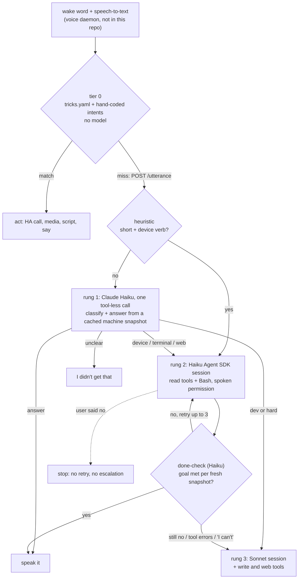

# voice-agent-router

A voice front end that answers each spoken request at the cheapest tier that can handle it. Plain commands never touch a model, questions get one Claude Haiku call, and only real jobs start a Claude Agent SDK session. Any session that wants to change something asks out loud first.

> **Status: work in progress.** The system this comes from runs at my desk every day and keeps changing. This extracted core passes its tests and has run against the live models, but expect rough edges and breaking changes.

## Why I built it

I wanted the Star Trek computer at my desk. Say "computer" from anywhere in the room and get things done: lights, the TV, "get the car ready", or "why won't the printer print". A smart speaker covers the first few, but it can't touch my own desktop, my scripts or my car, and a raw LLM with a shell is slow, costs money on every "lights off", and is one misheard TV line away from doing something I didn't ask for. So I built the part in between: a router that sends each request to the cheapest thing that can handle it, and asks before anything changes.

What I wanted:

1. Commands I say every day run instantly and cost nothing.
2. Questions get a short spoken answer, grounded in the machine's actual state.
3. Real work (pair the headphones, find out why the printer is offline) gets an agent with tools, but nothing that writes, deletes or sends runs without a clear spoken yes.

It has been in daily use since August 2026. This repo is the routing core pulled out of that system and cleaned up so it runs on its own. Home-specific parts (Home Assistant entity ids, the Kodi library matcher, the wake word and speech pipeline) are not included; see [What is not in this repo](#what-is-not-in-this-repo).

## How it works



**Tier 0: no model** (`router/tricks.py`, `examples/tricks.yaml`). A YAML list of phrase to action entries, reloaded when the file changes, so adding a phrase needs no restart. Phrases match the whole utterance ignoring case and punctuation, which is what Whisper gives you ("Movie night." vs "movie night"). A broken edit is logged and skipped; the last good set stays live. In production a set of hand-coded intents (media titles, percentages, chained commands like "lights 40 and AC 72") sits behind the YAML.

**Rung 1: Haiku classifies and often answers** (`router/ladder.py`). One tool-less call with a compact machine snapshot in the system prompt (`router/snapshot.py`: audio devices and volumes, bluetooth, printers, displays, temperatures, disks, failed services). "What's my volume" or "is the printer online" is answered with zero tool calls. The voice daemon blocks on this call, so there is a 1.05 s deadline: if Haiku has not returned, the daemon gets a silent ack and the answer is spoken when it arrives. The reply also carries a `done_when` condition that a later snapshot can check.

**Rungs 2 and 3: Agent SDK sessions that check their own work.** A headless session with Bash and read tools (rung 2, Haiku) or write and web tools too (rung 3, Sonnet). After every turn a cheap Haiku done-check compares the worker's report and a fresh snapshot against `done_when`, and re-prompts the same session with what is still missing, up to 3 rounds. A rung-2 attempt that misses its goal, hits two tool errors, or says "I can't" escalates to rung 3. It never de-escalates.

**Spoken permission** (`router/permissions.py`). Every tool call goes through the SDK's `can_use_tool` callback:

- `bash_is_readonly()` proves a command is read-only or it asks. It is deny-by-default and shell-aware: pipelines and `&&` are split and every segment is checked; `$(...)`, redirects, subshells and newlines reject the whole line. It also knows that `curl -d` is a submission, `curl ... | sh` is download-and-execute, `git branch x` creates a branch, `sed 's/a/b/w f'` writes a file, and `PAGER=x git log` runs a program.
- Anything else is read out ("Run touch home Downloads/notes.txt?") and needs a clear yes. A "Yes." the speech layer marks as unclear (TV in the background) counts as no.
- One question per task. After a no, or no answer, every later write in that task is denied silently and the task stops. No goal-loop retry and no escalation into a fresh session that would ask again.

The tool roster is passed as `tools=`, never `allowed_tools=`. An `allowed_tools` entry auto-approves the tool before `can_use_tool` is consulted. I measured it: with `allowed_tools=['Bash']` a `touch` ran with no callback and no question.

**MCP server** (`mcp_server/voice_mcp.py`). Registered user-wide, so every Claude Code session I open gets `say`, `ask`, `listen`, `notify` and friends (11 tools). A long build in one terminal can say "tests passed" out loud, or ask me a question while I am across the room. Every tool returns a short plain string instead of raising, because the voice daemon restarts often and a hung tool hangs the session.

## Measured in production

From the live logs, 2026-09-07 to 2026-10-05 (4 weeks, one desk, one user). `tools/measure_log.py` reproduces every number here from the raw logs (not published: they are a transcript of my house), and its docstring lists exactly which log lines count as what.

| | n | share |
|---|---:|---:|
| Commands handled with no model call (tier 0) | 182 | 76% |
| Commands sent to the model tiers | 56 | 24% |
| **Total commands that did something** | **238** | |

So about 3 in 4 spoken commands cost nothing. The model-free count is a floor: transport words like "pause" and "stop" are handled before routing and leave no outcome line.

What happened to the ones that reached the model tiers:

| | n |
|---|---:|
| Rung-1 Haiku classifications completed | 43 |
| ...answered on the spot | 7 |
| ...judged `unclear` and dropped | 34 |
| ...handed to a worker as a device job | 2 |
| Rung-1 calls that timed out (all in one run, during the lock-up below) | 6 |
| Short device commands that skipped rung 1 by keyword (straight to a worker) | 2 |
| Rung-2 Haiku agent sessions | 3 |
| Rung-3 Sonnet sessions | **0** |

The 56 posts outnumber the 51 rung-1 and keyword decisions because some went straight to the hands-free coding mode ([talk2code](https://github.com/JPInert/talk2code)) without a rung-1 call.

Two things stand out. Most of what reaches rung 1 is not a command at all: it is TV dialogue or room conversation that tripped the wake word, and rung 1 is the cheap filter that keeps it away from anything with tools. And in four weeks nothing needed Sonnet; every model call that did run was Haiku. Rung-1 latency was a median of 2.94 s, p90 3.88 s (n=43).

## The three-day lock-up

The best bug this system has had, and the reason `server.py` has the health check it has.

**Symptom.** Nothing. `/health` was green, the HTTP server answered, RSS sat flat at 67 MB. What I eventually noticed was heat: the CPU was sitting at 67 °C on an idle desktop.

**Finding it.** One process was burning a full core. Every utterance in the log for the previous three days had the same shape: `ack=silent` at 1.05 s, then `rung1 failed: TimeoutError()` at exactly +180.00 s, the outer timeout. The SDK child process the wedged session held had been alive for 3 days 0 h 44 m, which dated the onset against the CPU time burned (3 d 0 h 46 m).

**Cause.** `SentenceSpeaker.feed()` (`router/speaker.py`) speaks a streaming reply sentence by sentence and merges short sentences into the next one. The first version did that by putting the short sentence back in front of the buffer. The split keeps the punctuation, so that restored the input byte for byte and the loop re-split the same prefix forever, with no allocation (hence the flat memory). Any reply whose first sentence was under 25 characters ("OK. Let me check...") triggered it. It ran on the asyncio loop thread that every Agent SDK call shares, so the process stayed up and the health endpoint, on its own thread, stayed green while nothing was ever scheduled again.

**Fix.** Short sentences wait in a separate `pending` slot and every pass consumes one sentence boundary, so the buffer strictly shrinks. Before restarting I confirmed the pre-fix repro never returned and that 500 fuzzed chunked streams finished with no wedges and no text lost. `tests/test_speaker.py` keeps the broken version and asserts that it wedges, so the regression test is proven to catch the bug, then runs the same 500-stream fuzz on the fix. CPU went from 67 °C to 49 °C.

**Lesson.** A health check that only proves the HTTP thread is alive proves nothing about the work. `server.py`'s `/health` here schedules a no-op on the SDK loop and fails if it does not come back in 2 s. The extract also cancels a classify future that times out instead of abandoning it.

## Other things production taught it

Each of these is a comment next to the code it changed.

- **One clarifying question, then stop.** It used to ask up to two follow-up questions. In the log, all 5 second-round answers came back `unclear` too, because those chains start on room conversation and each question just records more of the room. Now rung 1 gets one shot.
- **Haiku sometimes tries to call a tool when told to classify** an imperative ("make me a file..."). With no tools and `max_turns=1` the query died. `max_turns=2` lets it recover.
- **The done-check demanded raw command output** it could never see, judged the job unfinished, and the user heard the same answer twice. The prompt now says the worker's report of a command's output is the record.
- **"Find another way"** as the denial message made the worker retry the same write as a bigger compound command. The message now says stop.
- **Spoken prose plus `say` calls** meant hearing every job twice, half of it the model thinking out loud. The `say` tool is the only channel; prose is spoken only if the session never spoke.
- **Permission prompts read raw shell** ("touch tilde slash..."). `speak_cmd()` turns `~/` into "home" and `&&` into "then" for speech only; logs keep the raw command.

## Running it

```bash
pip install -r requirements.txt

python3 -m pytest -q                 # 38 tests, no model calls
python3 demo.py --dry-run            # type utterances, see which tier claims them
python3 demo.py                      # real rungs via the Agent SDK (needs `claude` logged in)
python3 server.py                    # POST /utterance {"text": "..."} on 127.0.0.1:7782
```

```text
> Movie night.
  tier 0: trick 'movie night' (no model)
  [ha] light.turn_off {'entity_id': 'light.living_room'}
  [say] Enjoy the movie.
> dim the bedroom lamp
  rung 1 skipped: keyword says device job -> rung 2 worker
> what is the capital of France
  rung 1: would go to Haiku to classify
```

In `demo.py`, permission questions from rungs 2 and 3 are asked on the terminal, so you can watch a "no" stop a task:

```text
[terminal-1] ASK permission (Bash): Run touch .../workspace/hello.txt?
[terminal-1] permission denied (heard='no')
[terminal-1] rung=2 model=claude-haiku-4-5-20251001 elapsed=6.90s rounds=1 met=False
  [say] I stopped there — that needed your OK.
```

## Layout

```
router/tricks.py        tier 0: YAML phrase -> actions, hot reload, validation
router/ladder.py        rungs 1-3, done-check goal loop, permission callback, escalation
router/permissions.py   bash_is_readonly() and the speech-safe prompt helpers
router/speaker.py       streaming sentence speaker (the lock-up fix)
router/snapshot.py      compact machine-state snapshot, every probe on a short timeout
router/voice_io.py      say/ask over HTTP to the voice daemon, or on a terminal
mcp_server/voice_mcp.py stdio MCP server: voice tools for any Claude Code session
server.py               POST /utterance, GET /health with a real loop probe
demo.py                 terminal front end
tools/measure_log.py    reproduces the numbers above from the production logs
examples/tricks.yaml    sample tricks (placeholder entity ids)
```

## What is not in this repo

The production system around this core: the wake-word and speech daemon (openWakeWord, faster-whisper, a reSpeaker mic array, TTS, wake-confirmation gates tuned against recordings made in the room), the hand-coded intents for my media library and lights, the Home Assistant and Kodi clients, a session registry that lets the voice reach into Claude Code tabs already open on the desktop, and a hands-free "let's code" mode that speaks a live Claude Code session (published separately as [talk2code](https://github.com/JPInert/talk2code)). They are tied to one house and one set of devices, and the routing logic here is the part that carries over.

## Built with Claude Code

I designed, debugged and tuned this with Claude Code as my pair, and the system itself runs on the Claude Agent SDK. The lock-up above was tracked down in a Claude Code session working from the logs and process stats. I think that is the honest way to describe how this kind of automation gets built now, and it is a large part of the work I do.

## License

MIT
